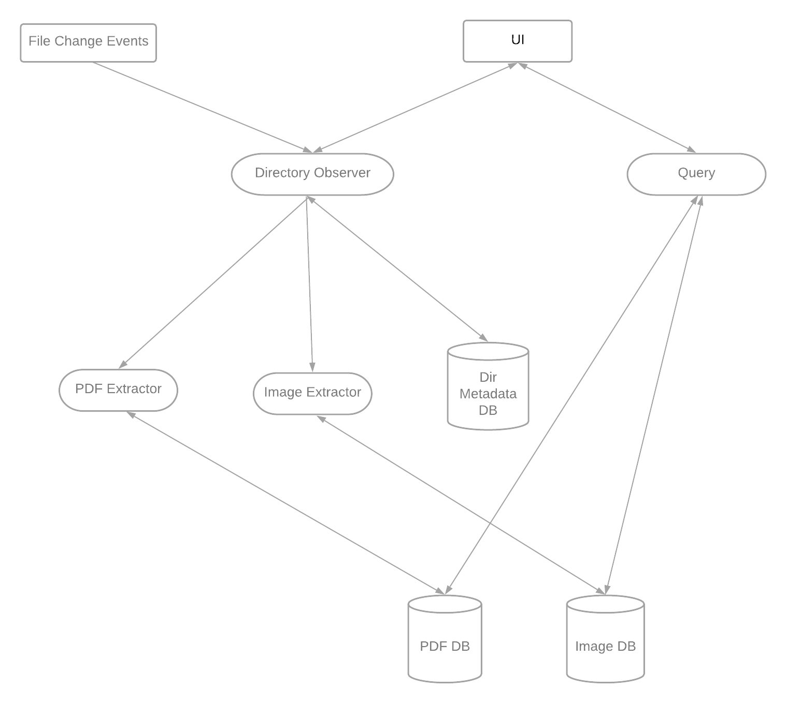

# AI-File-Assistant

For a long time, I've found the local file search results on my laptop to be less than satisfactory, especially when I want to search for an image or a PDF. I often remember only a few keywords from the file, but I forget the file name.

In recent months, I've witnessed the power of ChatGPT4 and the rapid development of the AI community. Seizing this opportunity, I decided to use ChatGPT4 along with open-source models and libraries to implement an AI file assistant from scratch in my spare time to improve the search quality of PDFs and images. This was a project that I didn't dare to think about before, because it involves knowledge from many different fields, and learning and using them all on my own would take a lot of time. Fortunately, now I have a "reliable" assistant, ChatGPT4, and I will use it to embark on this experiment.

I envision the AI file assistant having three main functions:

1. Users can specify the folders they want to track, and the AI file assistant can index the PDFs and images inside them. Of course, users can also cancel tracking of a folder.
2. Users can ask questions about a PDF file, and the AI file assistant can return the closest answer along with its source.
3. Users can enter several keywords for an image, and the AI file assistant can return the closest image source.

Of course, the front-end interface and the database are also indispensable. Here is the overall architecture of the AI file assistant system:

Without a doubt, this is just a simple local file management system. To make this assistant more useful and reliable, it would require the addition of more new features and more time for optimization. However, through this project, I want more people to know to maintain curiosity about new fields and new knowledge, to continue learning, and to use AI tools to make themselves more efficient and excellent.
